<div align="center">


<h1>Cloud FinOps Dashboard</h1>

<p><strong>The Strategic Operating System for Cloud Financial Management & Multi-Cloud Optimization</strong></p>

[]()
[]()
[]()
[]()

<br/>

> **"FinOps is not just about saving money. It's about making money."** 
> Cloud FinOps Dashboard is an industrial-grade intelligence platform designed to bridge the gap between Finance, Engineering, and Business teams, ensuring every cloud dollar spent is mapped to business value.

</div>

---

## 🏛️ Executive Summary

The **Cloud FinOps Dashboard** is a premier strategic platform designed for CFOs, CTOs, and FinOps practitioners. As enterprises move from single-cloud experiments to multi-cloud estates (Azure, AWS, GCP, K8s), the lack of unified visibility becomes the primary blocker to digital transformation.

This platform provides a centralized "Command Center" for the **FinOps Operating Model**, automating spend ingestion, allocation, and forecasting. It empowers organizations to shift from "Cost Cutting" to "Value Maximization" through automated rightsizing, reservation governance, and unit economic tracking.

---

## 💡 Why FinOps Matters

Cloud consumption is decentralized and variable. Without a dedicated FinOps framework:
- **Finance** lacks predictability and visibility into why costs are rising.
- **Engineering** lacks the financial context to make cost-aware architectural decisions.
- **Business Owners** cannot correlate cloud spend to product revenue or customer growth.

FinOps solves this by creating a **shared language** and a **culture of accountability**.

---

## 🚀 Business Outcomes

### 🎯 Key Performance Impact
- **80% Reduction in Idle Spend**: Automated identification and reclamation of unused resources.
- **95% Forecast Accuracy**: ML-driven spend prediction models to eliminate budget surprises.
- **100% Cost Attribution**: Mapping every resource to a Cost Center, Team, or Product.
- **Optimized Unit Economics**: Tracking "Cost per Transaction" to ensure profitable scaling.

---

## 📊 FinOps Operating Model: Crawl, Walk, Run

Our platform supports the FinOps Foundation's lifecycle across all maturity levels:

1. **Inform**: Visibility, Allocation, and Benchmarking.
2. **Optimize**: Rightsizing, RI/SP Management, and Architectural best practices.
3. **Operate**: Governance, Automation, and continuous improvement.

### KPI Framework
| KPI | Category | Description |
|---|---|---|
| **Tagging Coverage** | Inform | % of resources with mandatory business tags. |
| **RI/SP Coverage** | Optimize | % of compute spend covered by commitment discounts. |
| **Forecast Variance** | Inform | % difference between projected and actual spend. |
| **Unit Cost** | Operate | Cloud spend per unit of business value (e.g., Cost per Order). |

---

## 🛠️ Technical Stack

| Layer | Technology | Rationale |
|---|---|---|
| **Cloud** | Azure / AWS / GCP | Multi-cloud native architecture. |
| **Frontend** | React 18, Vite, Tailwind CSS | High-fidelity, reactive executive dashboards. |
| **Backend** | FastAPI (Python) | Asynchronous, type-safe API for large-scale data processing. |
| **Analytics Engine** | Python, Pandas, NumPy | Vectorized calculations for spend aggregation and forecasting. |
| **Database** | PostgreSQL | Relational storage for budget metadata and historical spend. |
| **Infra (IaC)** | Terraform | Standardized multi-cloud infrastructure orchestration. |
| **Observability** | OpenTelemetry, Prometheus | Full-stack visibility into ingestion pipelines and API health. |

---

## 📐 Architecture Storytelling: 40+ Diagrams

### 1. High-Level Executive Architecture
The holistic view of data flowing from cloud providers to business value insights.

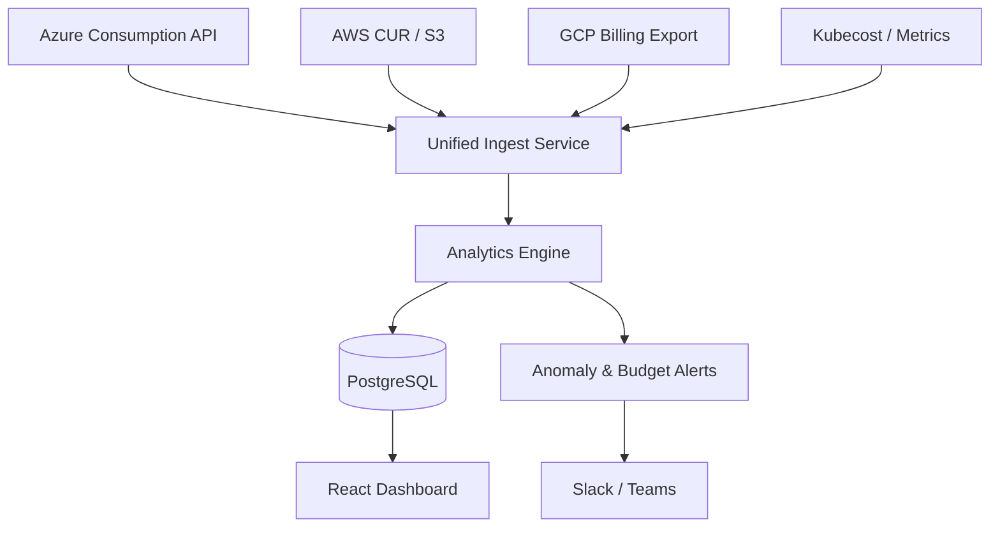

### 2. Detailed Component Topology
The internal microservice architecture and data persistence boundaries.

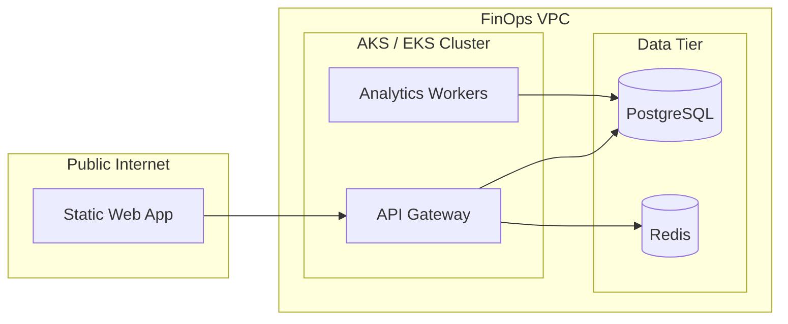

### 3. Frontend to Backend Request Path
Tracing a user's request for a cost breakdown.

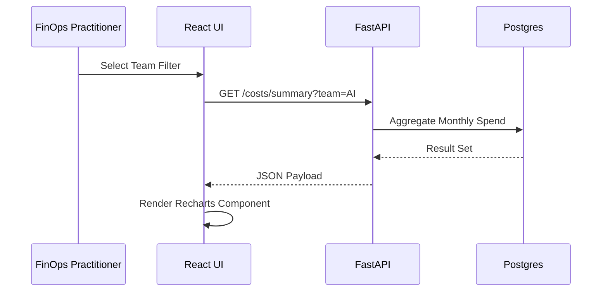

### 4. Data Warehouse Architecture
The multi-cloud schema for unified billing analysis.

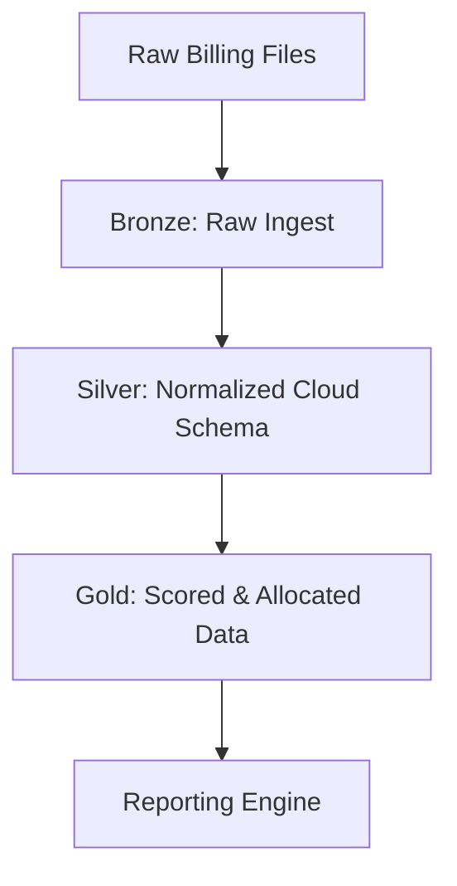

### 5. Multi-Cloud Ingestion Topology
Managing secure access to disparate cloud billing SDKs.

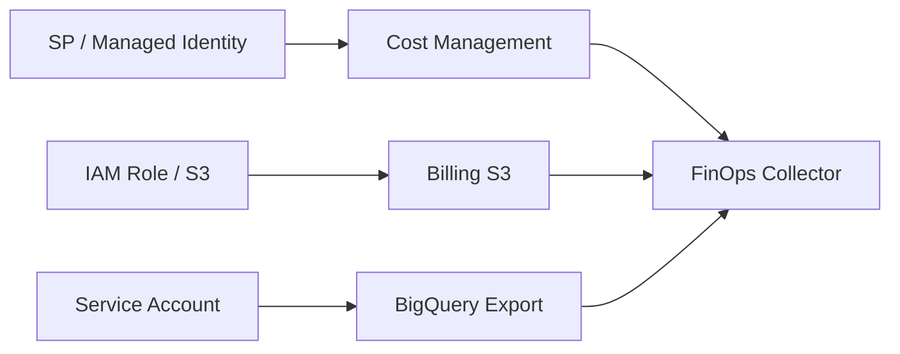

### 6. Regional Deployment Model
High-availability hosting for the global FinOps platform.

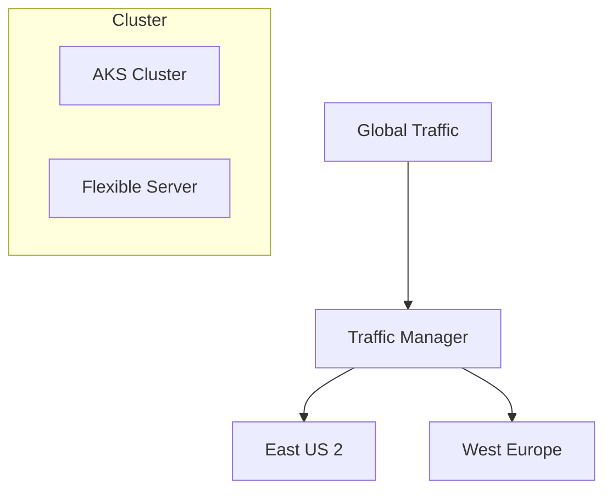

### 7. DR Failover Model
Business continuity for the critical financial oversight system.

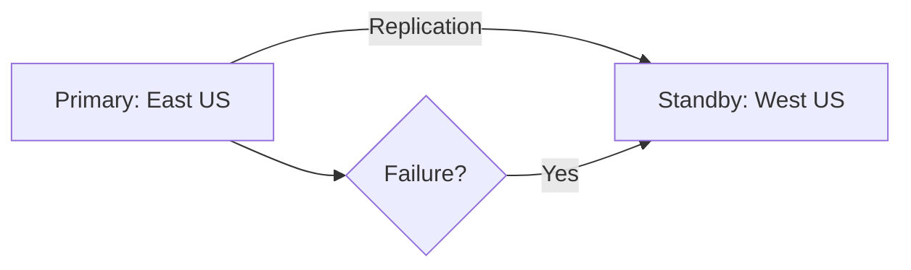

### 8. API Gateway Architecture
Securing and throttling the FinOps data interface.

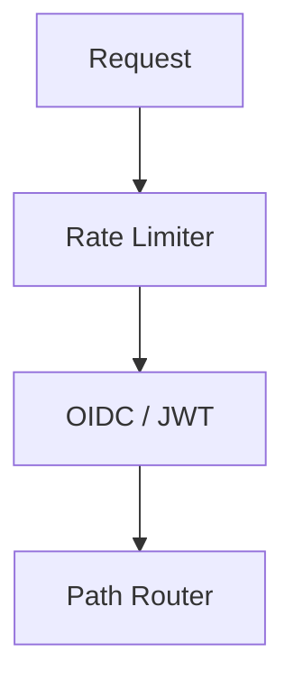

### 9. Queue Worker Architecture
Handling the "Heavy Lifting" of multi-gigabyte billing file parsing.

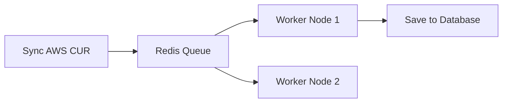

### 10. Dashboard Analytics Flow
How real-time metrics are served to the executive suite.

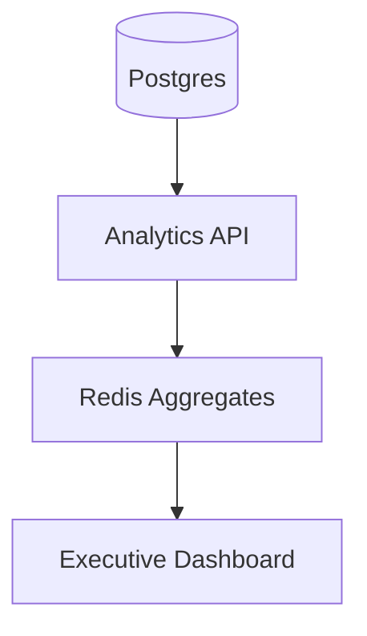

### 11. Cost Allocation Workflow
Mapping raw usage to organizational hierarchies.

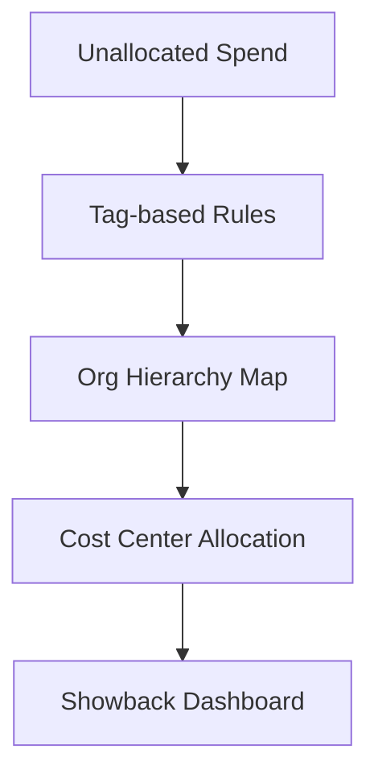

### 12. Budget Lifecycle Model
The automated flow from budget creation to threshold alerting.

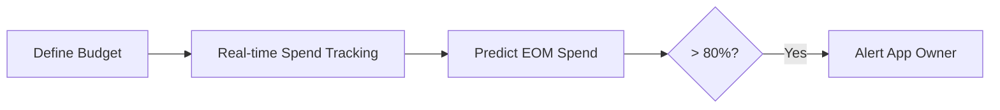

### 13. Forecast Generation Flow
Utilizing historical trends and seasonality to predict future spend.

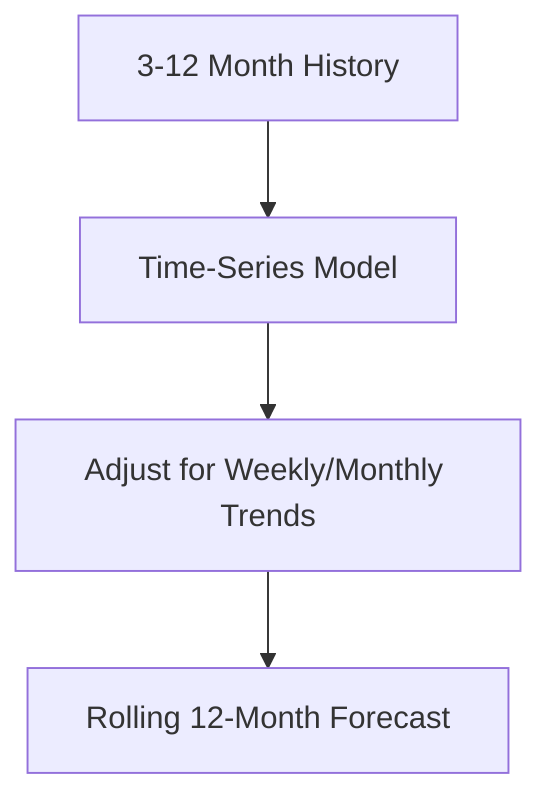

### 14. Rightsizing Recommendation Flow
Identifying under-utilized resources and recommending cheaper SKUs.

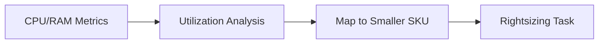

### 15. Reservation Governance Model
Centralizing the lifecycle of Reserved Instances and Savings Plans.

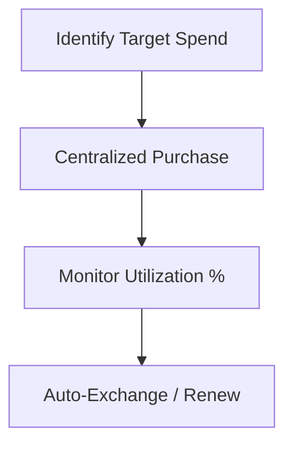

### 16. Savings Plan Optimizer Flow
Finding the "Sweet Spot" for commitment-based discounts.

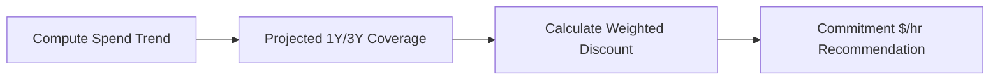

### 17. Kubernetes Cost Allocation Flow
Decomposing shared cluster costs by Namespace and Label.

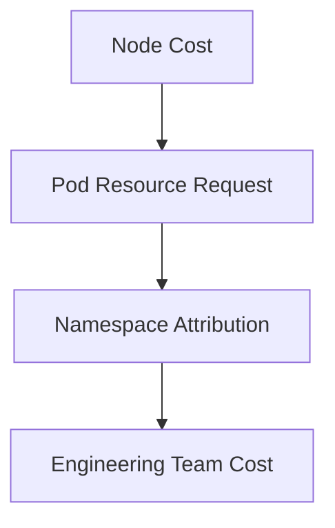

### 18. SaaS Spend Ingestion Flow
Consolidating diverse SaaS invoices into the FinOps portal.

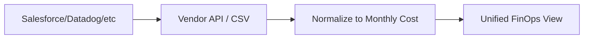

### 19. Chargeback Workflow
The process of "Invoicing" internal business units.

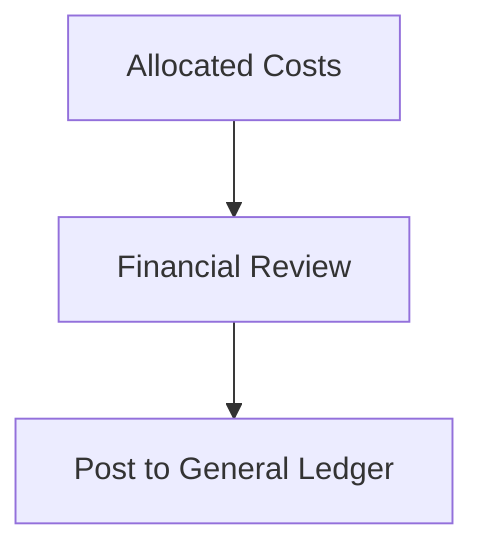

### 20. Showback Reporting Lifecycle
Driving awareness through transparent spend reporting.

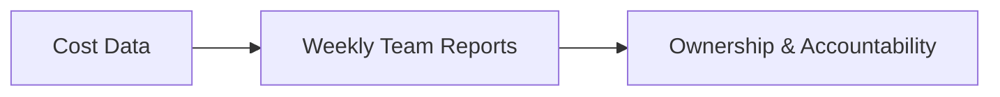

### 21. Unit Economics Model
Correlating cloud spend to business transactions.

```mermaid
graph LR
    Spend[Cloud Spend $] / Trans[Transactions #] --> Unit[Cost Per Transaction]
```

### 22. Cost per Transaction Model
Monitoring the efficiency of specific business operations.

```mermaid
graph TD
    Checkout[Checkout Service $] --> Orders[Orders Processed #]
    Orders --> KPI[Efficiency Metric]
```

### 23. Cost per Customer Model
Understanding the profitability of different customer segments.

```mermaid
graph LR
    Segment[Enterprise Tier] --> Usage[Resource Consumption]
    Usage --> Margin[Gross Margin Analysis]
```

### 24. Department Ownership Matrix
Mapping resources to budget holders.

```mermaid
graph TD
    Tag[Tag: Dept_ID] --> Master[Org Master Data]
    Master --> Owner[Budget Owner Name]
```

### 25. Executive Review Workflow
The preparation for monthly board-level briefings.

```mermaid
graph LR
    Gather[Gather KPIs] --> Analyze[Variance Analysis]
    Analyze --> ExecutiveSummary[Board Summary PDF]
```

### 26. Monthly FinOps Cadence
The recurring meeting structure for cost governance.

```mermaid
stateDiagram-v2
    Week1: Data Ingestion & Triage
    Week2: Rightsizing Reviews
    Week3: Budget Variance Review
    Week4: Executive Reporting
    [*] --> Week1
    Week1 --> Week2
    Week2 --> Week3
    Week3 --> Week4
    Week4 --> Week1
```

### 27. Savings Realization Model
Tracking the actual $ saved from optimization actions.

```mermaid
graph TD
    Old[Previous SKU Cost] --> New[New SKU Cost]
    New --> Delta[Monthly Savings Realized]
```

### 28. Product Profitability Flow
Subtracting cloud COGS from product revenue.

```mermaid
graph LR
    Revenue[Product Sales] --> CloudCost[Cloud COGS]
    CloudCost --> Net[Gross Product Profit]
```

### 29. Growth Cost Forecast Model
Predicting the cost impact of a marketing campaign or new launch.

```mermaid
graph TD
    Launch[New Region Launch] --> Infra[Infra Baseline]
    Infra --> Variable[Traffic Variable Cost]
```

### 30. Scenario Planning Workflow
Modeling "What-If" decisions.

```mermaid
graph LR
    Scenario[Move to ARM64] --> Model[Projected 20% Saving]
    Model --> Decision[Approved for Pilot]
```

### 31. OIDC / SSO Auth Flow
Securing the dashboard for enterprise users.

```mermaid
sequenceDiagram
    User->>Dashboard: Access URL
    Dashboard->>Entra: OIDC Request
    Entra-->>Dashboard: Identity Token
```

### 32. RBAC Model
Permissions based on organizational roles.

```mermaid
graph LR
    FinOps[Full Access]
    Engineer[View & Optimize]
    Finance[Read Reports]
```

### 33. Secrets Management Flow
Protecting cloud provider credentials.

```mermaid
graph TD
    Vault[Azure Key Vault] --> API[Secure Access]
```

### 34. Audit Logging Architecture
Ensuring transparency in financial changes.

```mermaid
graph LR
    Action[Budget Change] --> Log[Immutable Audit Log]
```

### 35. Network Boundary Model
Isolating the FinOps platform.

```mermaid
graph TD
    Internet --> WAF[Azure WAF]
    WAF --> PrivateVNet[VNet]
```

### 36. Metrics Pipeline
Monitoring the ingestion and API health.

```mermaid
graph LR
    API[Metrics] --> Prom[Prometheus]
```

### 37. Logging Flow
Centralized log management.

```mermaid
graph TD
    Log[JSON Logs] --> LogAnalytics[Azure Monitor]
```

### 38. Tracing Model
Tracing distributed ingestion jobs.

```mermaid
sequenceDiagram
    Sync->>AWS: Fetch CUR
    Sync->>Postgres: Bulk Insert
```

### 39. SLA Monitoring Model
Ensuring the "Cost Radar" is always active.

```mermaid
graph LR
    Probe[Health Probe] --> SLA[99.9% Uptime]
```

### 40. Release Pipeline Workflow
Automated delivery of the dashboard.

```mermaid
graph LR
    Code[Git Push] --> Build[CI/CD]
    Build --> Deploy[AKS Deployment]
```

---

## 🔬 FinOps Operating Model & Best Practices

### 1. The Decentralized Ownership Model
The platform is designed to push financial accountability down to the **Engineering Teams**. By providing "Team-Level Cost Explorers," engineers can see the direct cost impact of their code changes in real-time.

### 2. Allocation vs. Attribution
- **Allocation**: The systematic assignment of costs to shared resources (e.g., Support, Networking).
- **Attribution**: The direct mapping of resources to owners via **Mandatory Tagging Policies**.

---

## 🚦 Getting Started

### 1. Prerequisites
- **Azure CLI / AWS CLI** configured.
- **Docker Desktop**.
- **Terraform** (v1.5+).
- **Node.js** (v18+) and **Python** (v3.11+).

### 2. Local Setup
```bash
# Clone the repository
git clone https://github.com/Devopstrio/cloud-finops-dashboard.git
cd cloud-finops-dashboard

# Setup environment
cp .env.example .env

# Start core services
docker-compose up --build
```
Access the portal at `http://localhost:3000`.

---

## 🛡️ Governance & Security
- **Data Sovereignty**: The platform runs entirely within your VNet/VPC. No billing data leaves your controlled environment.
- **Identity First**: Native integration with **Microsoft Entra ID** and **AWS IAM Roles for Service Accounts (IRSA)**.
- **Audit Ready**: All financial configuration changes are logged with full user attribution.

---
<sub>&copy; 2026 Devopstrio &mdash; Engineering the Future of Cloud Financial Excellence.</sub>
