<div align="center">


<h1>Cloud FinOps Dashboard</h1>

<p><strong>The Institutional-Grade Platform for Standardized FinOps Foundations, Financial Governance, and Multi-Cloud Dashboard Ecosystems.</strong></p>

[]()
[]()
[]()

<br/>

> **"Industrializing cloud finance to automate financial foundations."** 
> **Cloud FinOps Dashboard** is an enterprise-grade platform designed to provide a secure, measurable, and highly automated foundation for global FinOps operations. It orchestrates the complex lifecycle of cloud financial management—from automated spend ingestion and multi-cloud cost attribution to high-throughput unit economics intelligence and unified financial auditing.

</div>

---

## 🏛️ Executive Summary

Fragmented spend visibility and lack of financial accountability are strategic operational liabilities; lack of a standardized FinOps dashboard framework is a primary barrier to organizational engineering maturity. Organizations fail to optimize their cloud margins not because of a lack of discounts, but because of fragmented measurement standards, lack of automated cost attribution, and an inability to orchestrate financial planes with operational precision.

This platform provides the **Financial Intelligence Plane**. It implements a complete **Cloud-FinOps-Dashboard-as-Code Framework**, enabling CFOs and FinOps practitioners to manage global financial foundations as first-class citizens. By automating the identification of financial leakage through real-time telemetry analysis and orchestrating the provisioning of secure performance-driven financial policies, we ensure that every organizational cloud dollar—from core compute clusters to edge microservices—is attributed by default, audited for history, and strictly aligned with institutional financial frameworks.

---

## 📐 Architecture Storytelling: Principal Reference Models

### 1. Principal Architecture: Global Cloud FinOps Dashboard & Financial Intelligence Plane
This diagram illustrates the end-to-end flow from financial telemetry ingestion and multi-cloud orchestration to dashboard enforcement, performance validation, and institutional financial auditing.

```mermaid
graph LR
    %% Subgraph Definitions
    subgraph FinancialIngress["Spend & Utilization Ingress"]
        direction TB
        Billing_Signals["Azure / AWS / GCP Billing Exports"]
        Usage_Metrics["Hourly Resource Utilization Logs"]
        Business_Context["Org Hierarchy / Cost Center Mappings"]
    end

    subgraph IntelligenceEngine["Financial Intelligence Hub"]
        direction TB
        API["FastAPI Financial Gateway"]
        AttributionOrchestrator["Global Cost & ROI Hub"]
        Governance_Hub["Compliance & Guardrail Hub"]
        AIOps_Validator["Drift & Waste Analysis Hub"]
    end

    subgraph OperationsPlane["Distributed Financial Ecosystem"]
        direction TB
        ManagedDashboardNodes["Managed Standardized Financial Hubs"]
        ActiveForecasts["Managed Automated Budget Packs"]
        ReportingSinks["Managed Infrastructure Delivery Hubs"]
    end

    subgraph OperationsHub["Institutional Data Hub"]
        direction TB
        Scorecard["Financial Maturity Scorecard"]
        Analytics["Savings Flow & ROI Velocity Stats"]
        Audit["Forensic Financial Metadata Lake"]
    end

    subgraph DevOps["Cloud-FinOps-Dashboard-as-Code Framework"]
        direction TB
        TF["Terraform Financial Modules"]
        DriftBot["Productivity & Config Drift Validator"]
        ChatOps["Measurement Operations Hub"]
    end

    %% Flow Arrows
    FinancialIngress -->|1. Submit Telemetry| API
    API -->|2. Orchestrate Finance| AttributionOrchestrator
    AttributionOrchestrator -->|3. Apply Privacy Guard| Governance_Hub
    Governance_Hub -->|4. Assess Drift| AIOps_Validator
    
    AIOps_Validator -->|5. Execute Analysis| OperationsPlane
    OperationsPlane -->|6. Notify Status| ChatOps
    API -->|7. Visualize Health| Scorecard
    
    Scorecard -->|8. Track Maturity| Analytics
    Scorecard -->|9. Record Performance| Audit
    
    TF -->|10. Provision Backbone| IntelligenceEngine
    DriftBot -->|11. Inject Friction Risk| AttributionOrchestrator
    Audit -->|12. Improve Operations| ManagedDashboardNodes

    %% Styling
    classDef ingress fill:#f5f5f5,stroke:#616161,stroke-width:2px;
    classDef intel fill:#e8eaf6,stroke:#1a237e,stroke-width:2px;
    classDef operations fill:#e1f5fe,stroke:#01579b,stroke-width:2px;
    classDef ops fill:#ede7f6,stroke:#311b92,stroke-width:2px;
    classDef devops fill:#e8f5e9,stroke:#1b5e20,stroke-width:2px;

    class FinancialIngress ingress;
    class IntelligenceEngine intel;
    class OperationsPlane operations;
    class OperationsHub ops;
    class DevOps devops;
```

### 2. The FinOps Lifecycle Flow
The continuous path of a cloud FinOps platform from initial integration (inform) and aggregation (optimize) to active analysis (operate), optimization (report), and institutional forensic auditing (scorecard).

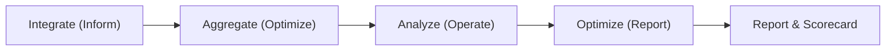

### 3. Distributed FinOps Topology
Strategically orchestrating standardized finance across global regions, diverse billing architectures, and multi-cloud targets, providing a unified institutional view of global financial health and operational readiness.

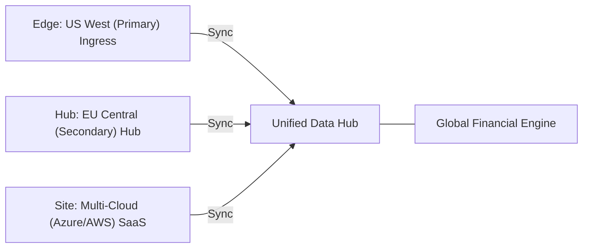

### 4. FinOps Hub & High-Trust Data Plane Protection Flow
Executing complex logic for securing the bridge between finance and engineering teams, ensuring every organizational identity is verified, financial-level privacy is maintained, and every financial access is according to institutional standards.

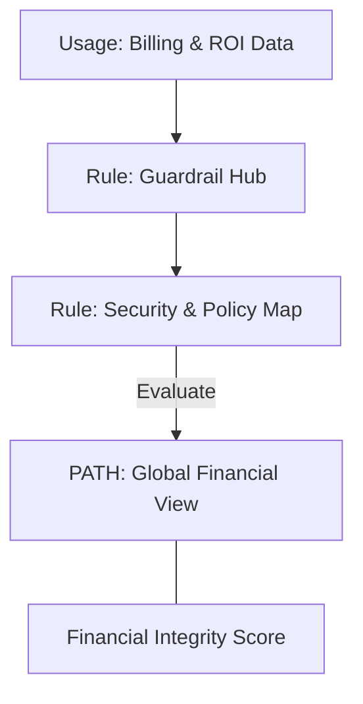

### 5. Multi-Cloud FinOps Federation & Governance Flow
Automatically managing unified financial standards across global regions and diverse cloud tenants, ensuring institutional data residency and privacy boundaries by default.

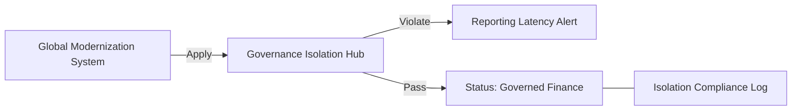

### 6. Encryption & Perimeter Protection Flow (FinOps Standard)
Managing the lifecycle of a financial request, automatically enforcing institutional TLS 1.3 and resource encryption standards as required by security policy, ensuring zero-latency security confidence.

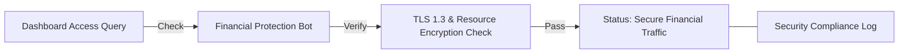

### 7. Institutional FinOps Maturity Scorecard
Grading organizational performance based on key indicators: Cost Attribution Index, Waste Remediation Index, and FinOps Adoption Scores.

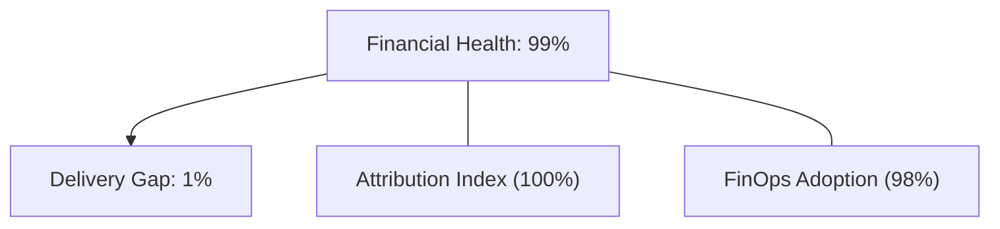

### 8. Identity & RBAC for FinOps Governance
Managing fine-grained access to financial hubs, provisioning workers, and audit logs between CFOs, FinOps Leads, and App Developers.

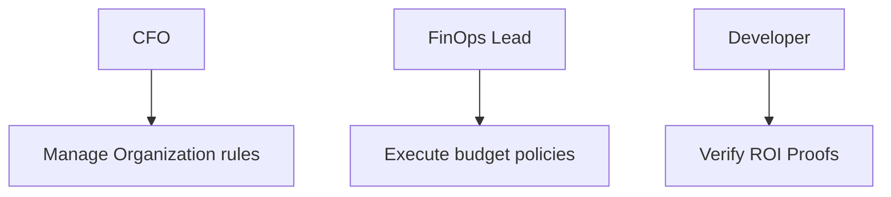

### 9. IaC Deployment: Cloud-FinOps-Dashboard-as-Code Framework
Using modular Terraform to deploy and manage the versioned distribution of the financial tracking hubs, attribution protection workers, and forensic metadata lakes.

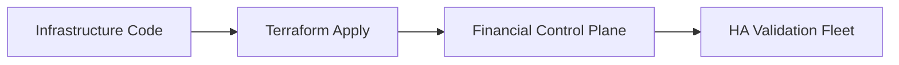

### 10. AIOps FinOps Drift & Risk Validation Flow
Using advanced analytics to identify sudden surges in cloud spend, unauthorized budget changes, suspicious configuration drifts, or unusual delivery pattern changes that could result in institutional risk or financial loss.

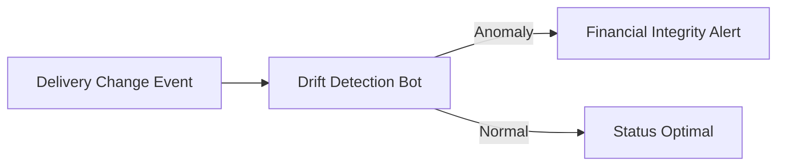

### 11. Metadata Lake for Forensic FinOps Audit
Storing long-term records of every financial integration event (metadata), every attribution executed, and every version history for institutional record-keeping, financial auditing, and post-provisioning forensics.

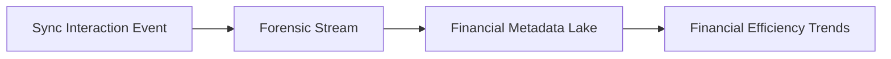

---

## 🏛️ Core Governance Pillars

1.  **Unified Foundation Coordination**: Maximizing resilience by centralizing all financial measurement through a single institutional plane.
2.  **Automated Attribution Provisioning**: Eliminating "manual tracking" scenarios through proactive orchestration and pattern verification.
3.  **Sequential ROI Intelligence**: Ensuring zero-interruption operations through dependency-aware savings-driven data engineering.
4.  **Zero-Trust Identity Protection**: Automatically enforcing identity-based access, data-at-rest encryption, and policy evaluation across all financial tiers.
5.  **Autonomous Operations Logic**: Guaranteeing reliability through automated industry-specific effectiveness monitoring runbooks.
6.  **Full Financial Auditability**: Immutable recording of every budget change and financial provision for institutional forensics.

---

## 🛠️ Technical Stack & Implementation

### Financial Engine & APIs
*   **Framework**: Python 3.11+ / FastAPI.
*   **Performance Engine**: Custom Python-based logic for multi-cloud spend ingestion and DORA-style FinOps metrics.
*   **Integrations**: Native connectors for Azure, AWS, GCP billing exports and K8s Cost APIs.
*   **Persistence**: PostgreSQL (Financial Ledger) and Redis (Live Ingestion State).
*   **Auth Orchestrator**: Federated OIDC/SAML for least-privilege financial management access.

### Governance Dashboard (UI)
*   **Framework**: React 18 / Vite.
*   **Theme**: Dark, Slate, Indigo (Modern high-fidelity productivity aesthetic).
*   **Visualization**: D3.js for delivery topologies and Recharts for ROI velocity analytics.

### Infrastructure & DevOps
*   **Runtime**: AWS EKS or Azure Kubernetes Service (AKS) for management plane.
*   **Measurement Hub**: Managed event sourcing for immutable productivity timeline reconstruction.
*   **IaC**: Modular Terraform for deploying the financial landing zone and validation fleet.

---

## 🏗️ IaC Mapping (Module Structure)

| Module | Purpose | Real Services |
| :--- | :--- | :--- |
| **`infrastructure/finops_hub`** | Central management plane | EKS, PostgreSQL, Redis |
| **`infrastructure/enforcers`** | Distributed dashboard provisioners | Azure, AWS, GCP APIs |
| **`infrastructure/finops_pipes`** | Data Ingestion Hubs | Webhooks, Lambda |
| **`infrastructure/auditing`** | Forensic modernization sinks | S3, Athena, Quicksight |

---

## 🚀 Deployment Guide

### Local Principal Environment
```bash
# Clone the Cloud FinOps Dashboard repository
git clone https://github.com/devopstrio/cloud-finops-dashboard.git
cd cloud-finops-dashboard

# Configure environment
cp .env.example .env

# Launch the Financial stack
make init

# Trigger a mock financial update and automated guardrail validation simulation
make simulate-finops
```

Access the Management Portal at `http://localhost:3000`.

---

## 📜 License
Distributed under the MIT License. See `LICENSE` for more information.

---
<div align="center">
  <p>© 2026 Devopstrio. All rights reserved.</p>
</div>
